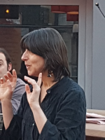

{: style="width:200px; float: right; margin-right: 30px;"}

Sono nata l'11 marzo a Mendrisio.
#Da sempre appassionata lettrice

- 2015 membro del comitato dell'associazione Albatros, che organizza il festival di letteratura per ragazzi "[Storie Controvento](http://www.storiecontrovento.ch/)"
- 2010 Organizzo con mio marito delle "Cene con storie"
- 2002 Sono narratrice, come mi definisco: raccontastorie, per biblioteche, musei e eventi.
- 2002 Animatrice alla lettura nelle scuole medie del Cantone
- 1990 nasce la mia passione per la narrazione e frequento diversi corsi.

- Sono socia della società svizzera delle fiabe, sezione della svizzera italiana (Intrecciafole)

- Ho ottenuto il diploma di maestra della scuola dell'infanzia, in seguito quello di educatrice specializzata alla scuola di Losanna.

In questi anni ho partecipato a corsi di

narrazione con: - Confabula -Mirella Guglielmoni -Claudio Cavalli -Giuseppe Gargiulo -Betty Colombo
-Roberto Anglisani

promozione alla lettura con:
- Associazione Hamelin -Caterina Ramonda -Gabriela Zucchini -Vera Salton
-Matteo Biagi