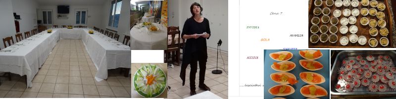

        Benvenuto amico,

        a questo ristorante.

        Qui troverai del cibo

		gustoso, sano, nutriente

		cibo per bocca, occhi, orecchie

		e cibo, che non guasta, per la mente

				“Non piagere cipolla” R. Piumini
                
 La cena  è un alternarsi di racconti scelti secondo un tema e di pietanze inerenti la storia. Ogni men&ugrave; &egrave; composto da un aperitivo ricco, antipasto, primo, piatto principale con contorno, dolci, caffè/tisana.

##Temi delle cene:

Storie in tutti i sensi  

A tavola con le fiabe, antiche e moderne 

Giro del mondo 

Cena d'autore   

7 vizi capitali 

Mela racconti ?

##Info pratiche:

La cena &egrave; elaborata e cucinata dalla A alla Z in collaborazione con mio marito.

 Il menu &egrave; fisso e a sorpresa, nella fase di iscrizione, si terr&agrave; conto di eventuali allergie e regimi particolari. 
Rivolta unicamente ad un pubblico adulto con un minimo di 15 partecipanti ed un massimo di 30, ha una durata di 3.00/3.30, a seconda dei gruppi.
           
Le cene con storie sono  gi&agrave; state realizzate in diversi luoghi: biblioteche, mense, case private, scuole. Ci preoccupiamo di tovaglie, piatti, servizio e riordino,  necessitiamo di un locale con tavoli e sedie e un cucinino .
Nel prezzo per persona, da stabilire, &egrave; tutto compreso, tranne il vino ed eventuali bibite.

Alla fine, ogni commensale, ricever&agrave; la bibliografia e il menu ! 
