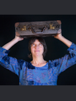

{: style="width:150px; float: left; margin-right: 10px;"}

&quot;Non c&apos;&egrave; Vascello che eguagli un Libro

Per portarci in Terre lontane

N&egrave; Corsieri che eguaglino una Pagina

Di scalpitante Poesia

{: style="width:200px; float: right; margin-right: 30px;"}

&Egrave; un Viaggio che anche il pi&ugrave; povero pu&ograve; fare

Senza paura di Pedaggio

Tanto frugale &egrave; il Carro

Che porta l&apos; Anima dell&apos; Uomo. &quot;  

Emily Dickinson, 1263

 
L&apos;ascolto &egrave;, per me, un viaggio condiviso.

Sono alla continua ricerca di nuove storie: leggo, mi diverto, scopro. 

Mi piacciono le sfide, cambiare genere, adatto le scelte agli ascoltatori, dai piccoli agli adulti, e alla situazione.

