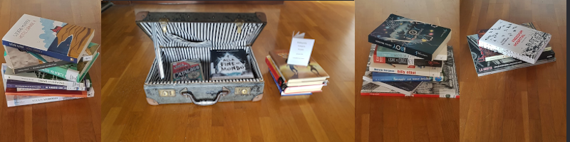

Uno dei miei intenti è contagiare i ragazzi con la passione per la lettura. 

Le mie scelte di libri si basano su corsi di aggiornamento (Hamelin, C. Ramonda, V. Salton, M. Biagi, F. Rotondo, G. Zucchini ), su festival di letteratura e sull'esperienza nel comitato dell'Associazione Albatros, che organizza il festival di letteratura per Ragazzi a Bellinzona "Storie Controvento".

Dopo attenta lettura propongo delle bibliografie ai bibliotecari di Scuola Media o ai docenti interassati. Le bibliografie possono essere a tema: avventura, amore, poesia, conflitti...,o sulle ultime novità dell'editoria. Sono però sempre adattate all'età dei ragazzi, tenendo conto che in una classe ci sono diversi tipi di lettori e non!