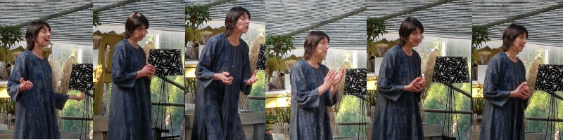

Ho gi&agrave; raccontato storie diverse: tradizionali, etniche, moderne, per bambini, ragazzi, adulti... 

## BIBLIOTECHE

Incontri regolari a Croglio, interventi alla Biblioteca dei ragazzi di Besso, Sorengo,  Curio...

## SCUOLE

Racconti specifici:

- per allievi di scuola media: 
    - Novelle
    - Miti
- per allievi di scuola elementare: 
    - Classici per Ragazzi
    - Natale
- per allievi di scuola dell’infanzia:                                             
                                                  

Dal 2002 la notte del racconto alla scuola media di Biasca
Doposcuola Sorengo
Liceo di Biasca

<iframe width="420" height="315"
  src="https://www.youtube.com/embed/3XfKCpA2L1Y">
</iframe>

## FESTE PRIVATE

Per aziende, gruppi genitori e associazioni 
Alpe di Firinescio, animazione di un pomeriggio con racconti e attivit&agrave; sul tema dei 5 sensi

## EVENTI PARTICOLARI
| anno | nome |
|------|------|
|2002 |  Esposizione nazionale, Yverdon e Morat nel ambito della societ&agrave; svizzera delle fiabe |
|2003 |  Thun, giornata nazionale della societ&agrave; delle fiabe |
|2003 |  Arzo, Festival del racconto Corte dei Miracoli |
|2006 |  Lugano, Trasguardi, Biblioteca di Besso |
