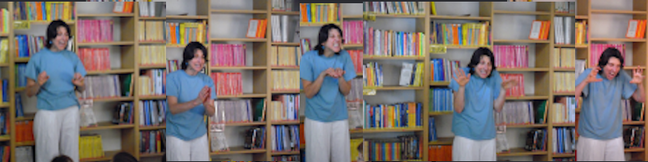
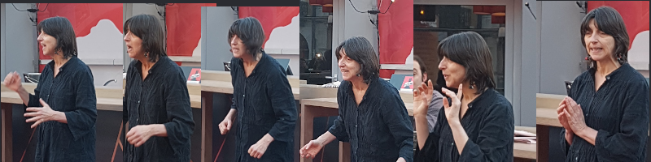
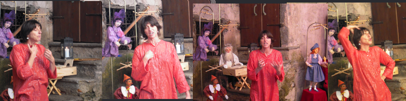

Tradizionali, etniche, moderne, per bambini, ragazzi, adulti... 

## BIBLIOTECHE

Incontri di narrazione secondo la richiesta dei bibliotecari. 
 
Animazioni con giochi e attivit&agrave;,alternati a storie per eventi particolari.

## SCUOLE

Racconti specifici, a richiesta del docente, inseriti nel programma:

- per allievi di scuola media: 
    - Novelle
    - Miti
    - Amore
    - Pofessioni...
- per allievi di scuola elementare: 
    - Classici
    - Miti
    - Animali
    - Fiabe...
 
Dopo scuola 
- per allievi di scuola dell’infanzia: 
    - Amicizia
    - Emozioni...
                                                  
## MUSEI

Per musei, mostre ed esposizioni preparo storie inerenti alla manifestazione

## NOTTE DEL RACCONTO
Dal 2002 partecipo alla notte del racconto, da diversi anni potete ascoltarmi nell&apos;alta Valle del Vedeggio.

Dal 2002 la notte del racconto alla scuola media di Biasca
Doposcuola Sorengo
Liceo di Biasca

## EVENTI

Per aziende, gruppi genitori e associazioni

## EVENTI CON ANIMAZIONI

Alterno narrazioni con attività:

   - 5 sensi
   - Di tutti i colori
   - Quante emozioni
   - Per filo e per segno
   - Storie di puzze e di profumi
   - 4 elementi...

