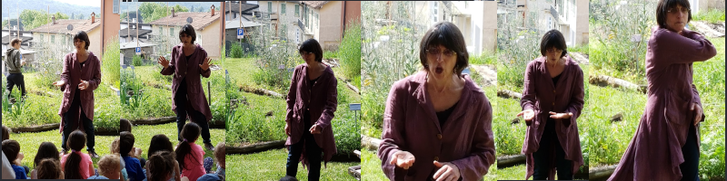
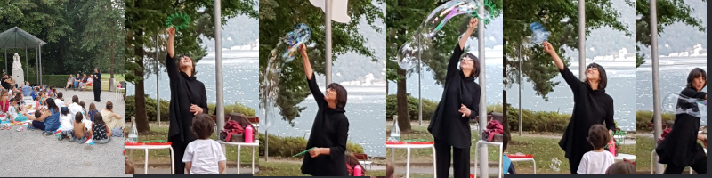

Tradizionali, etniche, moderne, per bambini, ragazzi, adulti... 

## BIBLIOTECHE

Incontri di narrazione secondo la richiesta dei bibliotecari. 
 
Animazioni con giochi e attivit&agrave;,alternati a storie per eventi particolari.

## SCUOLE

Racconti specifici, a richiesta del docente, inseriti nel programma:

- per allievi di scuola media, per esempio: 
    - Novelle
    - Miti
    - Emozioni
    - Pofessioni...
- per allievi di scuola elementare, per esempio: 
    - Classici
    - Miti
    - Animali
    - Fiabe...
 
Dopo scuola 
- per allievi di scuola dell’infanzia per esempio: 
    - Amicizia
    - Emozioni
                                                  
## MUSEI

Per musei, mostre ed esposizioni preparo storie inerenti alla manifestazione

## NOTTE DEL RACCONTO
Dal 2002 partecipo alla notte del racconto, da diversi anni potete ascoltarmi nell&apos;alta Valle del Vedeggio.

Dal 2002 la notte del racconto alla scuola media di Biasca
Doposcuola Sorengo
Liceo di Biasca

## EVENTI

Per aziende, gruppi genitori e associazioni

